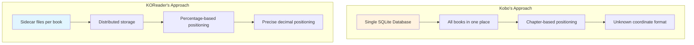
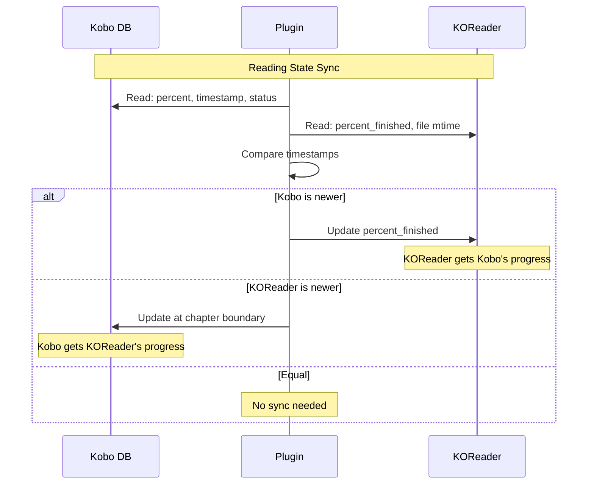

# Database & Data Storage Overview

This section explains how the plugin interacts with both Kobo's database and KOReader's storage
system to synchronize reading progress.

## The Fundamental Difference

## Why This Matters

These architectural differences create the core challenge the plugin solves:

1. **Storage location**: Kobo uses one central database, KOReader uses individual files
2. **Position format**: Kobo uses chapter+coordinate system (format unknown), KOReader uses
   percentages
3. **Precision**: Kobo can point to specific positions within chapters, KOReader tracks overall
   progress
4. **Timestamps**: Kobo stores ISO 8601 strings in database, KOReader uses file modification times

## Quick Reference

### Data Flow Summary

### Key Files in Codebase

| File                              | Purpose                             |
| --------------------------------- | ----------------------------------- |
| `src/lib/kobo_state_reader.lua`   | Reads progress from Kobo database   |
| `src/lib/kobo_state_writer.lua`   | Writes progress to Kobo database    |
| `src/lib/sync_decision_maker.lua` | Decides when/how to sync            |
| `src/reading_state_sync.lua`      | Coordinates sync operations         |
| `src/metadata_parser.lua`         | Queries Kobo database for book info |

See the individual topics above for detailed explanations of how each system works and how the
plugin bridges them.
