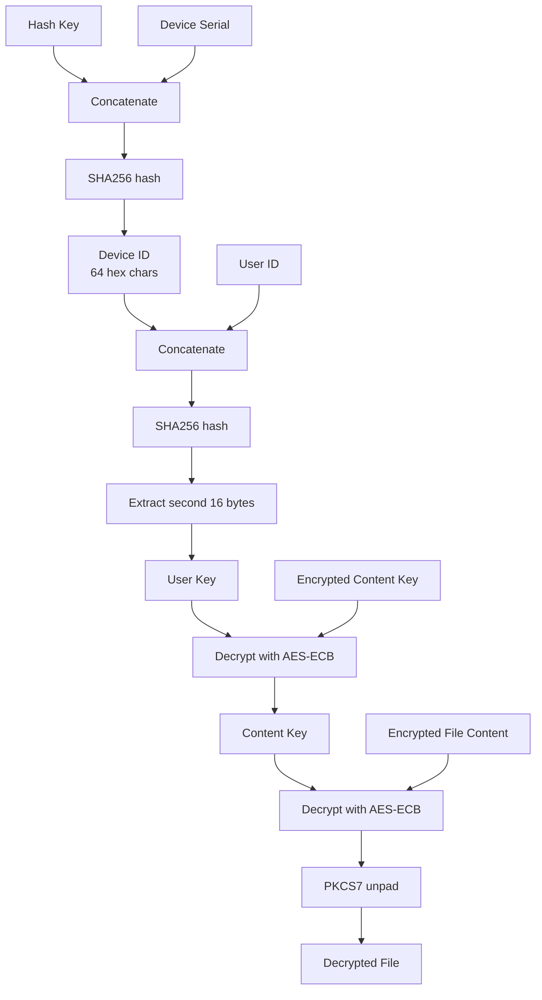

# DRM Decryption Investigation

**Related Issue:** [#73](https://github.com/OGKevin/kobo.koplugin/issues/73)

## Overview

This investigation documents Kobo's DRM (KDRM) system and how it encrypts purchased books. The
native Kobo firmware stores all necessary decryption keys in its SQLite database.

The goal is to document how to decrypt books on device so that they can be viewed by an alternative
reading software.

## Key Findings

### Required Data Sources

To decrypt KDRM-protected books, we need data from two sources:

1. **Device Serial** - From `/mnt/onboard/.kobo/version` (first comma-separated field)
2. **User ID** - From the `user` table in `KoboReader.sqlite`
3. **Content Keys** - From the `content_keys` table in `KoboReader.sqlite`

### Version File

The device serial is stored in the version file:

```
/mnt/onboard/.kobo/version
```

Format: `SERIAL,version,version,version,version,platform_id`

The first field before the comma is the device serial number.

### Database Tables

#### `user` Table - User Credentials

```sql
SELECT UserID FROM user;
```

Returns:

- `UserID`: UUID format (e.g., `12345678-abcd-1234-abcd-123456789abc`)

#### `content_keys` Table - File Encryption Keys

```sql
SELECT elementId, elementKey
FROM content_keys
WHERE volumeId = ?;
```

Structure:

- `volumeId`: Book identifier
- `elementId`: File path within EPUB (e.g., `OEBPS/image/cover.jpg`)
- `elementKey`: Base64-encoded encryption key for that specific file

### KDRM Encryption System

Characteristics:

- File-level encryption (not archive-level)
- Individual files within EPUB/KEPUB are AES-ECB encrypted
- Uses known hash keys for device ID derivation

### Key Hierarchy

The key derivation follows the approach documented in the
[obok project](https://github.com/noDRM/DeDRM_tools/blob/master/Obok_plugin/obok/obok.py):



### Known Hash Keys

Kobo uses a set of known hash keys for device ID derivation. The decryption process tries each until
one produces valid output:

- `88b3a2e13`
- `XzUhGYdFp`
- `NoCanLook`
- `QJhwzAtXL`

## Decryption Process

### Step 1: Read Device Serial

```python
# Read from /mnt/onboard/.kobo/version
# Parse first comma-separated field
serial = "N123456789012"
```

### Step 2: Get User ID from Database

```python
# SELECT UserID FROM user
user_id = "12345678-abcd-1234-abcd-123456789abc"
```

### Step 3: Derive User Key

```python
# Try each hash key until decryption succeeds
for hash_key in KOBO_HASH_KEYS:
    device_id = SHA256(hash_key + serial).hexdigest()
    user_key = SHA256(device_id + user_id).hexdigest()[32:]  # Second 16 bytes
```

### Step 4: Decrypt Content Keys

For each encrypted file in the book:

```python
encrypted_content_key = base64_decode(content_keys[element_id])
content_key = AES_ECB_decrypt(encrypted_content_key, user_key)
```

### Step 5: Decrypt File Content

```python
encrypted_content = read_from_epub_zip(element_id)
decrypted_content = AES_ECB_decrypt(encrypted_content, content_key)
final_content = pkcs7_unpad(decrypted_content)
```

### Step 6: Reconstruct EPUB

Create new ZIP with:

- Decrypted files replacing encrypted ones
- Unencrypted files copied as-is
- Original directory structure preserved

## References

- **[obok (DeDRM_tools)](https://github.com/noDRM/DeDRM_tools/tree/master/Obok_plugin)** - Primary
  reference for key derivation algorithm. The obok plugin by Physisticated et al. documents the
  complete KDRM decryption process for Kobo devices.
- **[KOkobo Plugin](https://github.com/TnS-hun/KOkobo)** - Lua implementation for KOReader that
  downloads and decrypts books via Kobo API
- **Native Database Schema** - See [Kobo Database Schema](../database/kobo/01-schema.md)
- **Issue #73** -
  [Investigate opening Kobo purchased books via virtual library](https://github.com/OGKevin/kobo.koplugin/issues/73)
- **Issue #119** - [DRM detection improvements](https://github.com/OGKevin/kobo.koplugin/issues/119)
